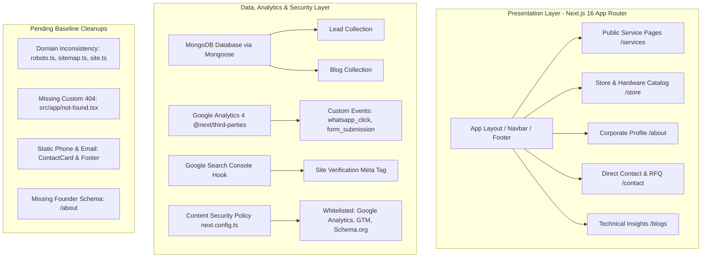
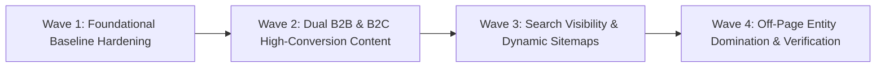

# 🛡️ Master Execution Strategy & System Architecture (`master_execution_strategy.md`)
## The Unified Single Source of Truth for Rex International (B2B + B2C Dual-Engine)

This document is the definitive master strategy, technical state audit, and operational execution blueprint for the Rex International web platform. It synthesizes all engineering guardrails from `ai_instructions.md`, lessons from `DISCARDED_CHANGES.md`, stable baselines from `CHANGELOG.md`, feature backlogs from `PLANNED_ROADMAP.md`, and master protocols from `playbook2`.

---

## 1. Current System State Summary

A comprehensive, line-by-line audit of the repository (`d:\rexinternational`) establishes the following current baseline:

### Technical Audit Details:
* **Tech Stack & Framework:** Next.js 16.2.9 (Turbopack), React 19.2.4, TailwindCSS v4, TypeScript 5.
* **Build & Compilation Health:** `npm run build` generates all 17 static and server-rendered routes in 3.4 seconds with **0 errors, 0 TypeScript warnings, and 0 lint failures**.
* **Database & Lead Pipeline:** Active connection to MongoDB via Mongoose (`^9.7.2`). Inbound RFQ submissions on `/contact` execute server-side validation with honeypot spam protection (`src/app/actions/contact.ts`) and persist directly to the `Lead` collection. Private admin panel operational at `/admin/leads/[secret]`.
* **Analytics Infrastructure:** `@vercel/analytics` has been completely uninstalled and purged. Ready with official Google Analytics 4 integration (`@next/third-parties/google`) and a non-blocking `trackEvent()` utility (`src/lib/analytics.ts`). GSC verification hook ready in `src/lib/seo.ts`.  
  *(Important Status: External GA4 & GSC accounts are pending creation by you. The codebase is safely **environment-variable gated**: until you add `NEXT_PUBLIC_GA_ID` and `NEXT_PUBLIC_GOOGLE_SITE_VERIFICATION` to `.env`, the code stays dormant with zero errors, and 100% of contact leads continue saving directly to your internal MongoDB database).*
* **Clean Scope Verification:** The orphaned `ShareServiceCTA.tsx` component was completely deleted. Service detail pages (`/services/[slug]`) are restored to clean, focused conversion CTAs: **"Get a Free Quote"** and **"WhatsApp Us"**.
* **Identified Technical Gaps (To Be Resolved in Wave 1):**
  1. *Domain Inconsistencies:* `robots.ts` and `sitemap.ts` contain legacy `lalanicomputers.com`, and `site.ts` has `example.com`. Must be unified to `https://rexinternational.store` via `getBaseUrl()`.
  2. *Missing Soft-404 Page:* `src/app/not-found.tsx` does not exist yet.
  3. *Unlinked Phone & Email:* Phone numbers and emails in `ContactCard.tsx` and `Footer.tsx` are static text, missing clickable `tel:`/`mailto:` links with GA4 event dispatch.
  4. *Missing Founder Schema:* `/about` lacks structured JSON-LD `Person` entities for Hansraj Lalani & Virat Lalani.

---

## 2. Actionable Roadmap (Filtered Through B2B + B2C Dual-Engine)

Every task below has been rigorously filtered through our **3-Pillar Filter (User Benefit, SEO/AEO/GEO, and Cascading Strategic Benefits)** and structured to serve both enterprise clients and retail consumers.

### Wave 1: Immediate Foundational Hardening (Zero Technical Debt)
* **Task 1.1: Canonical Domain Consolidation**
  * *User Benefit:* Reliable bookmarks, social shares, and consistent HTTPS navigation.
  * *SEO/AEO/GEO:* Eliminates duplicate-domain signals and consolidates PageRank onto `https://rexinternational.store`.
  * *Action:* Refactor `sitemap.ts`, `robots.ts`, `site.ts`, and schema generators to strictly consume `getBaseUrl()`.
* **Task 1.2: Dual-Recovery Soft-404 Shield (`src/app/not-found.tsx`)**
  * *User Benefit:* Prevents dead ends when visitors mistype a URL or click an expired link.
  * *SEO/AEO/GEO:* Injects `<meta name="robots" content="noindex, follow" />` to safeguard crawl budget.
  * *Action:* Build a branded 404 page offering dual recovery paths: *"Explore Corporate AMCs"* (for B2B) and *"Book a Workshop Diagnostic in Mulund"* (for B2C).
* **Task 1.3: Click-to-Call (`tel:`) & Click-to-Email (`mailto:`) Conversion Tracking**
  * *User Benefit:* Instant 1-tap calling for mobile users experiencing urgent printer breakdowns.
  * *Analytics Benefit:* Attaches `trackEvent('phone_click')` and `trackEvent('email_click')` to log high-intent inbound calls in GA4.
  * *Action:* Convert static text in `ContactCard.tsx` and `Footer.tsx` into accessible clickable links.
* **Task 1.4: Founder `Person` & Knowledge Graph Schema on `/about`**
  * *User Benefit:* High-trust proof of 45+ years of continuous service under the Lalani family.
  * *GEO Benefit:* Establishes Knowledge Graph entity anchors (`@id: https://rexinternational.store/#founder`) linking Rex International into AI overviews (Perplexity, Google AI).

---

### Wave 2: Dual B2B & B2C High-Conversion Content Architecture

#### Track A: Enterprise B2B Engine (High-Ticket Contracts)
* **Task 2.1: Industry Vertical Landing Pages (`/industries/*`)**
  * `/industries/banking-finance`: Passbook & teller printer fleet AMC, 4-hour branch SLA, zero-downtime teller desks.
  * `/industries/logistics-warehousing`: Heavy-duty continuous dotmatrix dispatch printers, shipping label/waybill printers, 24/7 Bhiwandi warehouse coverage.
  * `/industries/healthcare-diagnostics`: Medical diagnostic report laser printers, lab sample barcode printers, regulatory compliance print clarity.
* **Task 2.2: The B2B "Proof Graph" (`/case-studies/*`)**
  * Case Study 1 (Logistics): Overhaul of 60 dotmatrix invoicing printers across 12 logistics hubs in Bhiwandi.
  * Case Study 2 (Banking): Multi-branch cooperative bank AMC maintaining 99.8% uptime SLA.
  * Bidirectional internal linking between `/services/corporate-amc` and verified case studies.

#### Track B: Retail B2C & Local SMB Engine (Walk-In Repairs & Hardware Sales)
* **Task 2.3: Mulund Walk-In Diagnostic & Workshop Hub (`/repairs/walk-in-mulund`)**
  * Targets hyper-local consumer searches: *"printer repair shop near me"*, *"printer repair Mulund West"*.
  * Features: Free 30-minute bench diagnostic, "No Fix, No Fee" policy, exact landmark guidance (Next to Vikas Centre, Kamala Nehru Shopping Centre, 2 mins from Mulund Station), workshop hours (Mon–Sat 10 AM–8 PM), and interactive map.
* **Task 2.4: Hyper-Local Problem & Diagnostic Hubs (`/repairs/*`)**
  * `/repairs/inktank-cleaning-mumbai`: Epson EcoTank & Canon PIXMA horizontal white line / blank page chemical nozzle flush (transparent ₹950 starting price).
  * `/repairs/laser-toner-repair-mumbai`: HP LaserJet & Canon imageCLASS vertical black streak, fuser roller, and drum replacement (₹900 starting price).
  * `/repairs/retail-billing-printer-mumbai`: TVS & Epson dotmatrix printhead pin repair for grocery, pharma, and retail shop bill books (₹800 starting price).
* **Task 2.5: Frictionless Visual Diagnostic CTA ("Snap & Estimate")**
  * On all consumer repair pages, add a dedicated CTA:  
    `[ 📸 Send Error Photo on WhatsApp for Instant Estimate ]`
  * Automatically opens WhatsApp with a pre-filled message: *"Hi Rex International, my printer is [Model] and showing this error. Here is a photo/video. Can you provide a diagnostic estimate?"*
* **Task 2.6: Hardware Catalog E-Inquiry Integration (`/store`)**
  * Add a clear "Request B2C/B2B Price Quote" button to every product card in `src/app/(public)/store/page.tsx` that links directly to WhatsApp with the product name attached.

---

### Wave 3: Search Visibility, Crawl Budget & Dynamic Sitemaps
* **Task 3.1: Unified Dynamic Database XML Sitemap (`src/app/sitemap.ts`)**
  * Automatically aggregates core pages, all `/services/*`, all `/industries/*`, all `/repairs/*`, all `/case-studies/*`, and all `/store/*` with exact ISO 8601 `<lastmod>`.
* **Task 3.2: Internal Link Intent Firewall (Phase 11)**
  * Audit all blog links to ensure they link upward to commercial services using exact commercial anchors (e.g., *"consult our [corporate printer AMC technicians]"* or *"book an [Epson ink tank cleaning in Mumbai]"*) rather than generic phrases (*"click here"*).
* **Task 3.3: Core Web Vitals LCP Hero Preloading (Phase 12)**
  * Add `<link rel="preload" as="image" ... fetchpriority="high">` to above-the-fold hero assets to guarantee sub-1.2s LCP.

---

### Wave 4: Off-Page Entity Domination & Verification
* **Task 4.1: B2B & B2C Directory Submission Blueprint**
  * *B2B Authority:* IndiaMART (Verified OEM Supplier), TradeIndia, LinkedIn Company Page.
  * *B2C Local Dominance:* Google Business Profile (Mulund West - optimized for "printer repair near me"), JustDial, Sulekha, Apple Maps.
* **Task 4.2: Final Schema & Search Console Validation**
  * Test all schemas through Google's Rich Results Testing Tool (`LocalBusiness`, `Service`, `FAQPage`, `BreadcrumbList`, `Product`, `Person`).
  * Ping `https://rexinternational.store/sitemap.xml` directly to Google Search Console.

---

## 3. Alternative Blueprint Ideas (Pivots from DISCARDED_CHANGES.md)

In accordance with our **"Don't Just Delete — Pivot"** protocol, we do not discard business value when an implementation reveals a flaw. Below are the concrete, high-value alternative blueprints:

| Discarded Implementation | The Identified Failure Mode | The Superior Alternative Blueprint | Audience |
| :--- | :--- | :--- | :---: |
| **B2B Clipboard "Share Service" Button** | Silently copied URL without opening an app; broke on insecure/mobile contexts; cluttered the CTA block. | **B2B Pivot: Executive AMC Proposal Teardown (1-Page PDF)** A downloadable executive summary detailing SLA terms, fleet tiers (3 to 500+ printers), and preventive maintenance schedules that IT managers can send directly to CFOs.  **B2C Pivot: "Forward on WhatsApp" Deep-Link** A clean link that actually launches WhatsApp with pre-filled text: *"Check out this printer repair service in Mulund: [URL]"*. | B2B + B2C |
| **Vercel Web Analytics** | Capped at 2,500 events on free tier; recurring paid subscription; proprietary vendor lock-in. | **Dual Analytics Engine:** 1. **Google Analytics 4 (GA4):** 100% free forever, unlimited events, native integration with Google Search Console. 2. **Self-Hosted MongoDB Lead Vault:** Zero third-party scripts, 100% ad-blocker immune, all RFQs recorded in your private admin dashboard. | Internal |
| **Generic Consumer Blog Fluff** | Unlocalized global articles ("History of printers") attracting low-intent readers who will never visit Mumbai. | **Hyper-Local Mumbai Problem/Diagnostic Hubs (`/repairs/*`):** Specific troubleshooting pages for local printer owners (Epson EcoTank nozzle clogs, HP LaserJet toner streaks) that funnel directly into ₹800–₹950 walk-in repairs in Mulund. | B2C |
| **Edge Bot Proxy Middleware** | Unnecessary edge rewrite bloat for a problem Next.js App Router already natively solves with Server-Side Rendering (SSR). | **Native Next.js 16 SSR + Rich Open Graph Media:** 1200x630 Cloudinary banners, descriptive schema tags, and pre-rendered semantic HTML served directly to Googlebot, WhatsApp, and Slack scrapers. | B2B + B2C |

---

## 4. Mandatory Pre-Flight Validation Checklist

This checklist must be executed before deploying, closing, or committing any task:

### 1. Code Retention & Clean Scope
* [ ] Zero orphaned components, unused buttons, or dormant script tags left in the codebase.
* [ ] Any paused or discarded code is 100% cleanly excised from JSX, components, and imports.
* [ ] `CHANGELOG.md` and `DISCARDED_CHANGES.md` are updated simultaneously with the exact changes and rationale.

### 2. Dual B2B + B2C User Experience (UX)
* [ ] Does this feature serve its target audience (corporate buyer or retail consumer) with zero friction?
* [ ] Does the UI behave exactly as labeled (no silent clipboard copies or misleading action names)?
* [ ] Are primary conversion paths (WhatsApp chat, RFQ quote, phone call) clear, uncrowded, and prominent?
* [ ] Has this been tested across viewports: Desktop (1920x1080), Laptop (1366x768), and Mobile (375x667 touch)?

### 3. SEO, AEO & GEO Optimization
* [ ] **SEO:** Server-rendered semantic HTML with single `<h1>`, clean canonical tag, and dynamic sitemap entry.
* [ ] **AEO:** 40–60 word declarative answer block beneath primary question headers for featured snippet extraction.
* [ ] **GEO:** Structured comparison tables, primary data attribution, and schema `@id` Knowledge Graph linkages.
* [ ] **Schema Validity:** Valid JSON-LD structured data with zero warnings on Schema.org Validator.

### 4. Environmental & Technical Safety
* [ ] Verified on both HTTPS and local network HTTP/LAN IPs (no fragile browser API crashes).
* [ ] Zero console errors, zero CSP violations, zero layout shifts (CLS < 0.05).
* [ ] Production build passes cleanly (`npm run build` exits with code 0).
